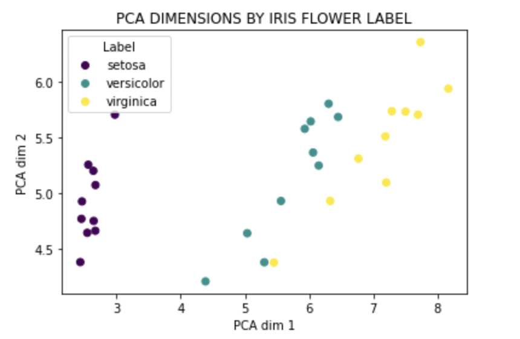
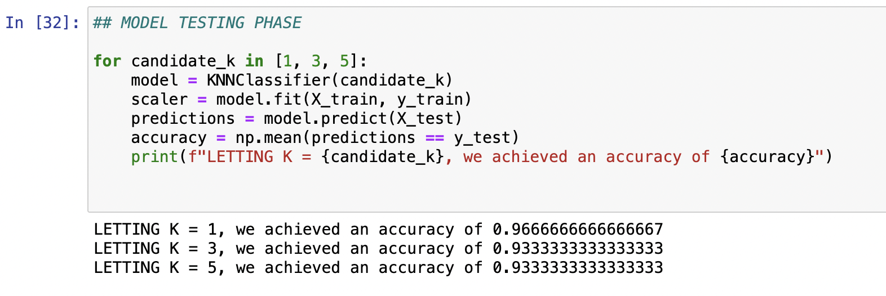
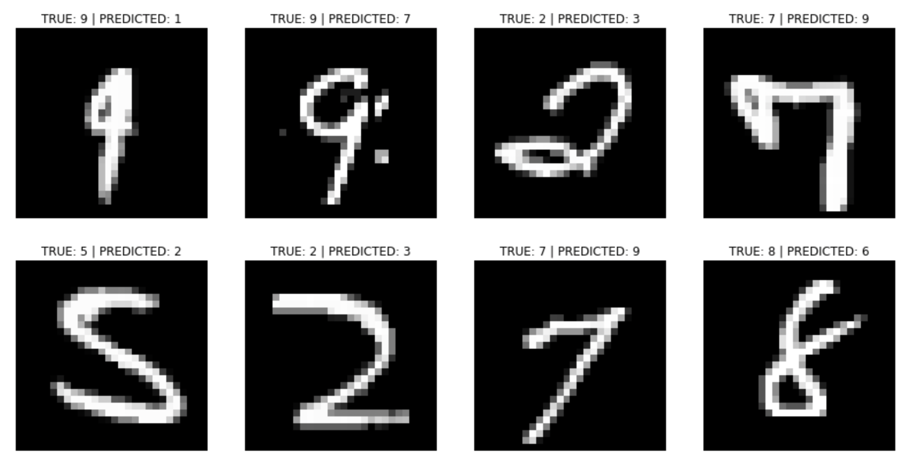

<h1>KNN Classification: Iris and MNIST</h1>

This project explores K-Nearest Neighbors (KNN) classification on two well-known datasets.

First, the model is applied to the Iris dataset, which contains measurements from three species of flowers. The classes are visualized in feature space before fitting the classifier.

The same KNN implementation is then used on the MNIST dataset to classify handwritten digits based on their pixel values. After training, inspect incorrectly classified images to see which types of images our KNN classifier performed poorly on

The goal was simply to experiment with a distance-based classifier on both a small structured dataset and a larger image dataset, and to have a boilerplate KNN python class to be used in future applications.
